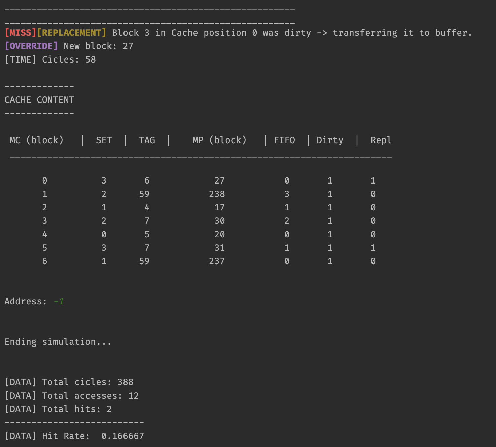

# CacheSIM

</a>

Los binarios se pueden encontrar en la carpeta `CacheSym/bin` - para ejecutar el programa: `./CacheSym`.

Si se desea compilar el simulador de Cache desde las fuentes, tan sólo hay que situarse en el directorio del proyecto desde línea de comandos y ejecutar los siguientes comandos:

1) ``cmake .``
2) ``make``
3) ``./CacheSym``

# About CacheSim

Proyecto realizado por Aingeru Garcia (a.k.a Basajaun), para la asignatura  de arquitectura de computadores (Facultad de Informática de Donostia).

